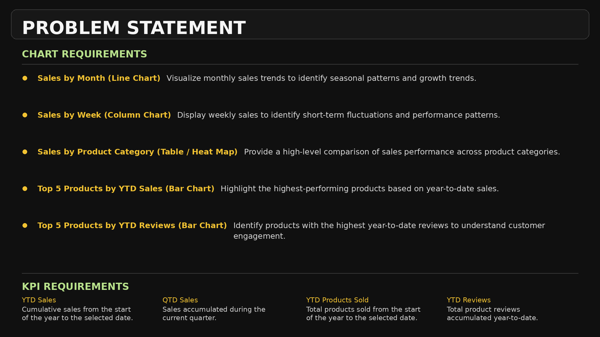

# 📊 Amazon Product Sales Analysis -- Power BI

## 📌 Project Overview

**Amazon Product Sales Analysis** is an interactive **Power BI dashboard** developed to analyze Amazon sales performance, product categories, customer reviews, and sales trends over time.

The project uses an Amazon sales dataset containing **89,082 records and 6 source columns** covering product category, product description, price, reviews, shipment information, and order date.

The dashboard provides a clear view of overall sales performance and helps identify **top-performing products, high-performing categories, sales trends, and potential business opportunities**.

---

## 🎯 Business Objective

The main objective is to transform raw Amazon sales data into an interactive business intelligence dashboard that helps stakeholders:

* Monitor **YTD and QTD sales performance**
* Analyze monthly and weekly sales trends
* Compare product-category performance
* Identify top-performing products
* Analyze customer engagement through reviews
* Identify high and low-performing categories
* Support data-driven sales and marketing decisions

---

## ❓ Business Questions

The dashboard answers key questions such as:

* What are the current **YTD Sales** and **QTD Sales**?
* How do sales change month by month?
* Which weeks have the highest sales?
* Which product categories contribute the most to sales?
* What are the **Top 5 products by YTD Sales**?
* What are the **Top 5 products by YTD Reviews**?
* Which categories are underperforming?
* How does sales performance change across quarters?

---

## 🎯 Problem Statement

The objective of the analysis is to convert raw Amazon product sales data into an interactive dashboard that provides insights into **sales performance, product trends, category contribution, and customer engagement**.



---

## 📊 Dashboard

The dashboard provides a consolidated view of **sales KPIs, product performance, category analysis, and time-based sales trends**.

### Key Dashboard Features

* 📈 YTD Sales
* 📊 QTD Sales
* 📦 YTD Products Sold
* ⭐ YTD Reviews
* 📅 Sales by Month
* 📅 Sales by Week
* 🏆 Top 5 Products by YTD Sales
* ⭐ Top 5 Products by YTD Reviews
* 📋 Sales by Product Category
* 🎛️ Product Category & Quarter Filters

### Main Dashboard


### Insights Dashboard


---

## 📈 KPIs

The dashboard tracks four major KPIs:

| KPI                   | Description                                                        |
| --------------------- | ------------------------------------------------------------------ |
| **YTD Sales**         | Total sales from the beginning of the year up to the selected date |
| **QTD Sales**         | Total sales generated during the current quarter                   |
| **YTD Products Sold** | Total number of products sold during the year                      |
| **YTD Reviews**       | Total number of reviews associated with products during the year   |

---

## 🗂️ Dataset

**Source:** `Dataset/Amazon_Combined_Data.xlsx`

The dataset contains **89,082 rows and 6 columns**:

| Column                | Description                |
| --------------------- | -------------------------- |
| `Product Category`    | Product category           |
| `Product Description` | Product name/description   |
| `Price(Dollar)`       | Product price in USD       |
| `Number of reviews`   | Number of customer reviews |
| `Shipment`            | Shipment information       |
| `Order Date`          | Order date                 |

---

## 🧹 Data Preparation & Modeling

The data was prepared and modeled in Power BI before creating the dashboard.

Key steps included:

* Imported the Excel dataset into Power BI
* Checked and corrected data types
* Converted `Order Date` into a date field
* Created a dedicated **Calendar Table**
* Created Month, Month Number, Quarter, Quarter Number, and Week fields
* Established the required date relationship
* Created DAX measures for KPIs
* Applied formatting to numerical values and dashboard visuals

---

## 🗓️ Calendar & Time Intelligence

A dedicated Calendar Table was created using the minimum and maximum order dates.

The Calendar Table includes:

* Date
* Month
* Month Number
* Quarter
* Quarter Number
* Week

Time-intelligence calculations were used for:

* **YTD Sales**
* **QTD Sales**
* **YTD Products Sold**
* **YTD Reviews**

---

## 🧮 DAX

DAX was used to create calculated columns and measures for the dashboard.

Key functions used include:

`CALENDAR()` | `FORMAT()` | `MONTH()` | `QUARTER()` | `CONCATENATE()` | `WEEKNUM()` | `SUM()` | `COUNT()` | `TOTALYTD()` | `TOTALQTD()`

The complete DAX calculations are available in:

`DAX/DAX_Measures.txt`

---

## 🎛️ Dashboard Interactivity

The dashboard includes interactive slicers for:

* **Product Category**
* **Quarter**

Selecting different values dynamically updates the dashboard KPIs and visualizations.

---

## 🔍 Key Insights

The analysis highlights several important findings:

* 🏆 **Men Shoes** is the top category, contributing **43.18% of YTD Sales**.
* 📈 **December** records the highest sales, with strong growth from **September onwards**.
* 💰 **Men Shoes and Camera** together contribute approximately **66% of YTD Sales**.
* ⭐ **SanDisk** has three products among the Top 5 products by YTD Reviews.
* ⚠️ **Mobile & Accessories** contributes only **1.80% of YTD Sales**, indicating an area for further investigation.
* 📦 Approximately **27.75K products** were sold.

---

## 💡 Business Takeaways

Based on the analysis:

* Focus on **Men Shoes and Camera** to maintain strong revenue contribution.
* Plan inventory and marketing activities ahead of the **September–December sales period**.
* Investigate **Mobile & Accessories** to understand its low sales contribution.
* Compare product reviews with sales to identify products with strong customer interest.
* Use monthly and weekly trends to support inventory and campaign planning.

---

## 🛠️ Tools & Technologies

* **Power BI**
* **DAX**
* **Power Query**
* **Microsoft Excel**
* Data Modeling
* Time Intelligence
* Data Visualization
* Business Intelligence

---

## 📁 Repository Structure

```text
Amazon-Product-Sales-Analysis-PowerBI/
│
├── DAX/
│   └── DAX_Measures.txt
│
├── Dataset/
│   └── Amazon_Combined_Data.xlsx
│
├── PowerBI/
│   └── Amazon Product Sales Analysis.pbix
│
├── Screenshots/
│   ├── Amazon_Sales_Problem_Statement.png
│   ├── Insights.png
│   └── dashboard.png
│
└── README.md
```

---

## 🚀 How to Use

Open `PowerBI/Amazon Product Sales Analysis.pbix` in **Power BI Desktop** and refresh the dataset if required. Use the **Product Category** and **Quarter** filters to explore the dashboard.

---

## 🎯 Skills Demonstrated

**Power BI | DAX | Power Query | Data Cleaning | Data Modeling | Time Intelligence | KPI Development | Data Visualization | Business Analysis | Dashboard Development**

---

## 👩‍💻 Author

**Girija Girish Gade**

Data Analyst | SQL | Python | Power BI | Excel

---

## ⭐ If you found this project useful

Feel free to explore the dashboard, review the DAX calculations, and
provide feedback or suggestions for improvement.
