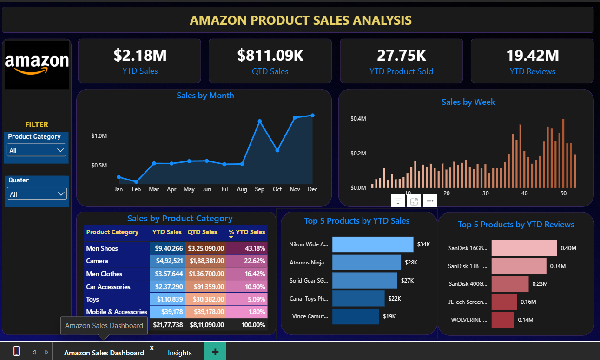
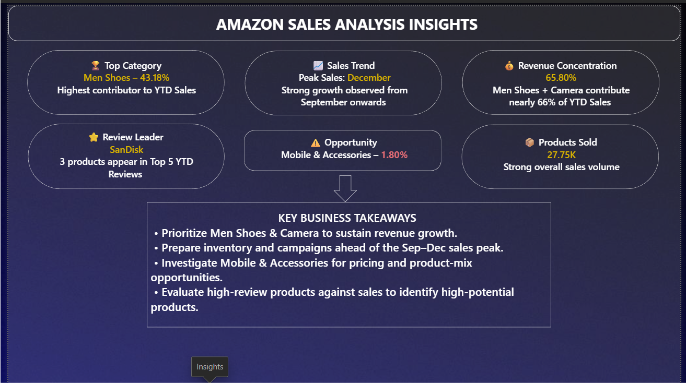

# 📊 Amazon Product Sales Analysis -- Power BI

## 📌 Project Overview

**Amazon Product Sales Analysis** is an interactive **Power BI
dashboard** developed to analyze Amazon product sales, product
performance, customer reviews, and sales trends over time.

The project uses an Amazon sales dataset containing **89,082 records and
6 source columns** covering product category, product description,
price, reviews, shipment information, and order date.

The dashboard was designed to answer key business questions around:

-   Overall Year-to-Date (YTD) and Quarter-to-Date (QTD) sales
    performance
-   Monthly and weekly sales trends
-   Product-category contribution to revenue
-   Top products by YTD sales
-   Top products by YTD reviews
-   Product sales volume
-   Identifying high-performing and underperforming product categories

------------------------------------------------------------------------

## 🎯 Business Objective

The main objective of this project is to transform raw Amazon sales data
into an interactive business intelligence dashboard that helps
stakeholders:

1.  Monitor overall sales performance.
2.  Identify important sales trends and seasonal patterns.
3.  Understand which product categories contribute most to revenue.
4.  Identify top-performing products.
5.  Analyze customer engagement through product reviews.
6.  Identify categories that may require pricing, product-mix, or
    marketing attention.
7.  Support data-driven inventory and campaign planning.

------------------------------------------------------------------------

## ❓ Business Questions

The dashboard was created to answer the following business questions:

### Sales Analysis

-   What are the current **YTD Sales** and **QTD Sales**?
-   How do sales change month by month?
-   Which weeks show the highest and lowest sales?
-   Is there any noticeable seasonal or time-based sales pattern?

### Product Category Analysis

-   Which product category contributes the most to YTD sales?
-   What percentage of total YTD sales does each category contribute?
-   Which categories are underperforming?

### Product Performance

-   What are the **Top 5 products by YTD Sales**?
-   What are the **Top 5 products by YTD Reviews**?
-   Do products with high customer reviews also generate high sales?

### Business Performance

-   How many products were sold during the year?
-   Which categories should receive more focus?
-   What opportunities exist for improving lower-performing categories?

------------------------------------------------------------------------

## 📋 Chart Requirements

The dashboard includes the following visualizations:




  -----------------------------------------------------------------------
  Visualization                       Purpose
  ----------------------------------- -----------------------------------
  **Sales by Month -- Line Chart**    Analyze monthly sales trends and
                                      identify seasonal patterns

  **Sales by Week -- Column Chart**   Identify short-term sales
                                      fluctuations

  **Sales by Product Category --      Compare category-level sales
  Table/Heat Map**                    performance

  **Top 5 Products by YTD Sales --    Identify major revenue-generating
  Bar Chart**                         products

  **Top 5 Products by YTD Reviews --  Identify products receiving the
  Bar Chart**                         highest customer engagement
  -----------------------------------------------------------------------

------------------------------------------------------------------------

## 📅 What is YTD?

**YTD (Year-to-Date)** represents the cumulative value from the **beginning of the year up to the selected/current date**.

In this project, YTD is used to track cumulative **sales, products sold, and reviews** throughout the year. For example, if the selected date is in September, YTD Sales represents the total sales from January through September.

YTD analysis helps stakeholders understand **overall year performance, measure progress toward targets, compare performance over time, and identify whether the business is on track for the year**.

## 📈 KPI Requirements

The dashboard tracks four major KPIs:

### 1. YTD Sales

Measures total sales generated from the beginning of the year up to the
selected date.

### 2. QTD Sales

Measures sales generated during the current quarter up to the selected
date.

### 3. YTD Products Sold

Measures the total number of products sold during the year.

### 4. YTD Reviews

Tracks the total number of reviews associated with products during the
year.

------------------------------------------------------------------------

## 🗂️ Dataset

### Source File

`Amazon_Combined_Data.xlsx`

### Dataset Structure

The raw dataset contains the following fields:

  Column                    Description
  ------------------------- -------------------------------------------
  **Product Category**      Category to which the product belongs
  **Product Description**   Detailed product name/description
  **Price(Dollar)**         Product price in USD
  **Number of reviews**     Number of customer reviews
  **Shipment**              Shipment/delivery destination information
  **Order Date**            Date on which the order was recorded

### Dataset Size

-   **Rows:** 89,082
-   **Columns:** 6
-   **Date field:** `Order Date`
-   **Sales-related field:** `Price(Dollar)`
-   **Customer engagement field:** `Number of reviews`

------------------------------------------------------------------------

## 🧹 Data Preparation

Before building the dashboard, the dataset was prepared for analysis in
Power BI.

Key preparation steps included:

-   Loading the Amazon dataset into Power BI
-   Checking column data types
-   Converting `Order Date` into a proper date field
-   Creating a dedicated **Calendar Table**
-   Establishing a relationship between the Calendar Table and Amazon
    sales data
-   Creating calculated columns required for time-based analysis
-   Creating DAX measures for KPIs and dashboard visuals
-   Applying appropriate formatting to currency, percentages, and
    numerical values

------------------------------------------------------------------------

## 🗓️ Calendar Table

A dedicated Calendar Table was created to support time-intelligence
analysis.

The Calendar Table contains fields such as:

-   Date
-   Month
-   Month Number
-   Quarter
-   Quarter Number
-   Week

The Calendar Table enables calculations such as:

-   YTD
-   QTD
-   Monthly analysis
-   Weekly analysis
-   Quarter-based filtering

------------------------------------------------------------------------

## 🧮 DAX & Calculated Columns

DAX was extensively used to create business calculations and support
interactive dashboard analysis.

### Key DAX Concepts / Functions Used

The project demonstrates the use of functions/concepts including:

-   `CALCULATE()`
-   `SUM()`
-   `COUNT()`
-   `DISTINCTCOUNT()`
-   `DIVIDE()`
-   `TOTALYTD()`
-   `TOTALQTD()`
-   `FILTER()`
-   `TOPN()`
-   `ALL()`
-   `MAX()`
-   `VALUES()`
-   `IF()`
-   Date/time intelligence
-   Calculated columns
-   Measures
-   Filter context

> **Note:** The exact DAX expressions in the `.pbix` file are the source
> of truth for the calculations. The examples below illustrate the type
> of calculations implemented in the project.

### Example: Sales Measure

``` dax
Total Sales =
SUMX(
    'Amazon_Data',
    'Amazon_Data'[Price(Dollar)]
)
```

### Example: YTD Sales

``` dax
YTD Sales =
TOTALYTD(
    [Total Sales],
    'Calendar Table'[Date]
)
```

### Example: QTD Sales

``` dax
QTD Sales =
TOTALQTD(
    [Total Sales],
    'Calendar Table'[Date]
)
```

### Example: YTD Reviews

``` dax
YTD Reviews =
TOTALYTD(
    SUM('Amazon_Data'[Number of reviews]),
    'Calendar Table'[Date]
)
```

### Example: % YTD Sales

``` dax
% YTD Sales =
DIVIDE(
    [YTD Sales],
    CALCULATE(
        [YTD Sales],
        ALL('Amazon_Data'[Product Category])
    )
)
```

### Example: Top 5 Products

A `TOPN()`-based calculation/filtering approach was used to identify the
products contributing the highest YTD sales and the products receiving
the highest number of reviews.

------------------------------------------------------------------------

## 🎛️ Dashboard Interactivity

The dashboard includes interactive filters/slicers for:

-   **Product Category**
-   **Quarter**

Users can select different categories or quarters to dynamically update
the dashboard visuals and KPIs.

------------------------------------------------------------------------

## 📊 Dashboard Pages

### 1. Amazon Product Sales Analysis

The main dashboard provides:

-   YTD Sales
-   QTD Sales
-   YTD Products Sold
-   YTD Reviews
-   Sales by Month
-   Sales by Week
-   Sales by Product Category
-   Top 5 Products by YTD Sales
-   Top 5 Products by YTD Reviews
-   Product Category and Quarter filters

### 2. Amazon Sales Analysis Insights

The insights page summarizes the major findings from the dashboard.

#### 🏆 Top Category

**Men Shoes -- 43.18%**

Men Shoes is the highest contributor to YTD sales.

#### 📈 Sales Trend

**December** records the peak sales, with strong growth observed from
**September onwards**.

#### 💰 Revenue Concentration

**Men Shoes + Camera contribute approximately 66% of YTD Sales**,
indicating a high concentration of revenue in these two categories.

#### ⭐ Review Leader

**SanDisk** products dominate the Top 5 products by YTD reviews, with
three products appearing among the leading reviewed products.

#### ⚠️ Opportunity

**Mobile & Accessories -- 1.80%**

This category has a relatively low contribution to YTD sales and may
require further investigation into pricing, product mix, inventory, or
marketing strategy.

#### 📦 Products Sold

Approximately **27.75K products** were sold, indicating strong overall
product movement.

------------------------------------------------------------------------

## 💡 Key Business Takeaways

Based on the dashboard analysis:

-   **Prioritize Men Shoes and Camera** to sustain revenue growth.
-   Prepare inventory and marketing campaigns ahead of the
    **September--December sales peak**.
-   Investigate **Mobile & Accessories** for pricing and product-mix
    opportunities.
-   Compare highly reviewed products with their sales performance to
    identify products with strong customer interest but potentially
    lower revenue.
-   Monitor revenue concentration to reduce dependency on a small number
    of categories.
-   Use monthly and weekly sales trends to improve inventory and
    campaign planning.

------------------------------------------------------------------------

## 🛠️ Tools & Technologies

-   **Power BI**
-   **DAX**
-   **Power Query**
-   **Microsoft Excel**
-   Data Modeling
-   Time Intelligence
-   Interactive Dashboard Design

------------------------------------------------------------------------

## 📁 Recommended GitHub Repository Structure

``` text
Amazon-Product-Sales-Analysis/
│
├── README.md
│
├── Dataset/
│   └── Amazon_Combined_Data.xlsx
│
├── PowerBI/
│   └── Amazon_Product_Sales_Analysis.pbix
│
├── Screenshots/
│   ├── dashboard.png
│   ├── insights.png
│   ├── problem-statement.png
│
└── DAX/
    └── DAX_Measures.txt
```

------------------------------------------------------------------------

## 🚀 How to Use the Project

1.  Clone or download this repository.
2.  Open the `.pbix` file using **Microsoft Power BI Desktop**.
3.  If required, update the dataset/source path.
4.  Refresh the data.
5.  Use the Product Category and Quarter slicers to explore the
    dashboard.
6.  Navigate between the dashboard and insights pages to understand the
    analysis.

------------------------------------------------------------------------

## 📌 Project Highlights

This project demonstrates practical Power BI skills including:

-   Data import and transformation
-   Data modeling
-   Calendar table creation
-   DAX measures
-   Calculated columns
-   Time-intelligence functions
-   KPI development
-   Top-N analysis
-   Interactive slicers
-   Business-focused dashboard design
-   Data storytelling and insight generation

------------------------------------------------------------------------

## 🎯 Skills Demonstrated

**Power BI \| DAX \| Power Query \| Data Cleaning \| Data Modeling \|
Time Intelligence \| KPI Analysis \| Data Visualization \| Business
Analysis \| Dashboard Development**

------------------------------------------------------------------------

## 👩‍💻 Author

**Girija Girish Gade**

Data Analyst \| SQL \| Python \| Power BI \| Excel

------------------------------------------------------------------------

## ⭐ If you found this project useful

Feel free to explore the dashboard, review the DAX calculations, and
provide feedback or suggestions for improvement.
